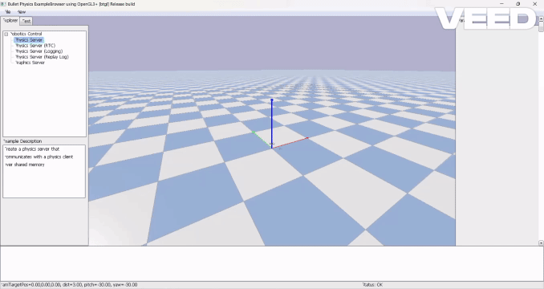
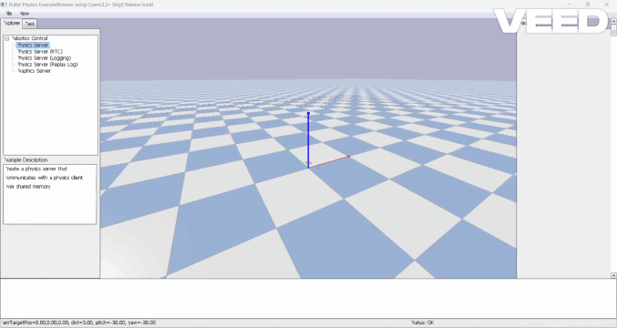

# CrazyFlie-Control-RL

A modular framework for reinforcement learning-based control of CrazyFlie drones in PyBullet environments.

---

## 📦 Project Structure

```
gym_pybullet_drones/
│
├── assets/                # Drone models, trajectories results, etc
├── envs/                  # Custom Gymnasium environments
│   ├── RandomPointAviary
│   ├── TestRandomPointAviary
│   ├── ConstantPerturbation 
│   └── ImpactPerturbation
│
├── control/               # Control parameters (PID)
├── utils/                 # Logging, plotting, and helper functions
├── examples/              # Training, evaluation and pid scripts
│   ├── learn.py 
│   └── evaluation.py
│
└── README.md
```

---

## 🚀 Getting Started

### 1. Installation

Clone the repository and install the dependencies:

```sh
git clone https://github.com/Pxlsko/CrazyFlie-Control-RL.git
cd CrazyFlie-Control-RL

conda create -n drones python=3.10
conda activate drones

pip install --upgrade pip
pip install -e .
```

### 2. Training an Agent

To train a reinforcement learning agent, run:

```sh
cd gym_pybullet_drones/examples
python learn.py
```

- You can adjust training parameters and environments in `learn.py`.
- The trained agent will be saved in the `results/name` folder.

### 3. Evaluating a Trained Agent

To evaluate a trained policy, run:

```sh
cd gym_pybullet_drones/examples
python evaluation.py
```

- The script loads the agent from `results/` and runs it in the selected environment.
- Results and plots will be displayed at the end of the simulation and saved in the path specified in the `plot_custom` function in `Logger.py`.

---

## 🧩 Environments

- **RandomPointAviary**: Training environment used to teach the agent to reach a random target position.
- **TestRandomPointAviary**: Test environment for trajectory following or hovering at multiple waypoints. You can select `circle`, `square`, `random`, `helix`, or `random_and_hover` in the script.
- **ConstantPerturbation**: Test environment to reject a constant external force.
- **ImpactPerturbation**: Test environment to reject an impact perturbation.

Each environment is customizable via parameters in the example scripts.

---

## 🤖 Trained Agent Policy

The trained agent policy will be included in the `results/name` folder (`name` must match what you set in `learn.py`):

- `best_model.zip`: Stable Baselines3 PPO agent.
- `final_model.zip`: Final checkpoint after training.

**Evaluation Results of the Trained Agent Policy (Trajectoryresults):**

Below are visual results (GIFs) of the agent's performance in different trajectory scenarios:

**With TestRandomPointAviary environment**

1. **Random Point Reach**
   
   

2. **Random Points & Hover**
   
   

3. **Square Trajectory**
   
   

4. **Circle Trajectory**
   
   

5. **Helix Trajectory**
   
   

**With ConstantPerturbation environment**

   

**With ImpactPerturbation environment**

   

**How to Use:**

- Place the trained model in `results/name/`.
- In `evaluation.py`, select the test environment you want: `TestRandomPointAviary`, `ConstantPerturbation`, or `ImpactPerturbation`.
- Run `evaluation.py` to visualize and analyze performance in the selected environment.


---

## 📊 Results & Visualization

- Training logs and TensorBoard files are saved in `results/name/tb/`. You can see the training progress by typing in terminal:

```sh
tensorboard --logdir = results\Trajectoryresults\tb # or where you have saved your trained model in learn.py
```

- Evaluation metrics (mean reward, precision at waypoints) are printed and plotted.
- Example plots include position tracking, orientation, and velocity comparisons.

---

## 📚 References

- [Gym-pybullet-drones] (https://github.com/utiasDSL/gym-pybullet-drones.git)
- [PyBullet](https://github.com/bulletphysics/bullet3/)
- [Stable Baselines3](https://github.com/hill-a/stable-baselines)
- [Anaconda](https://www.anaconda.com/)
- [Gymnasium](https://arxiv.org/abs/2407.17032)
- [TensorBoard](https://github.com/tensorflow/tensorboard?tab=readme-ov-file)
- [CrazyFlie](10.1109/ICRA.2011.5980409)

---
